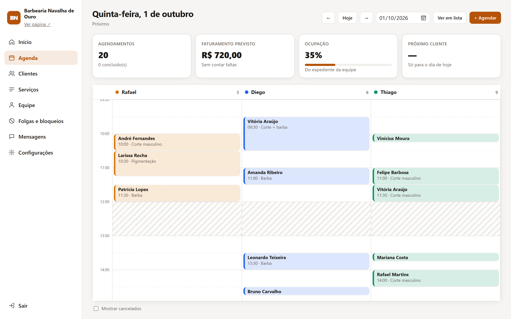
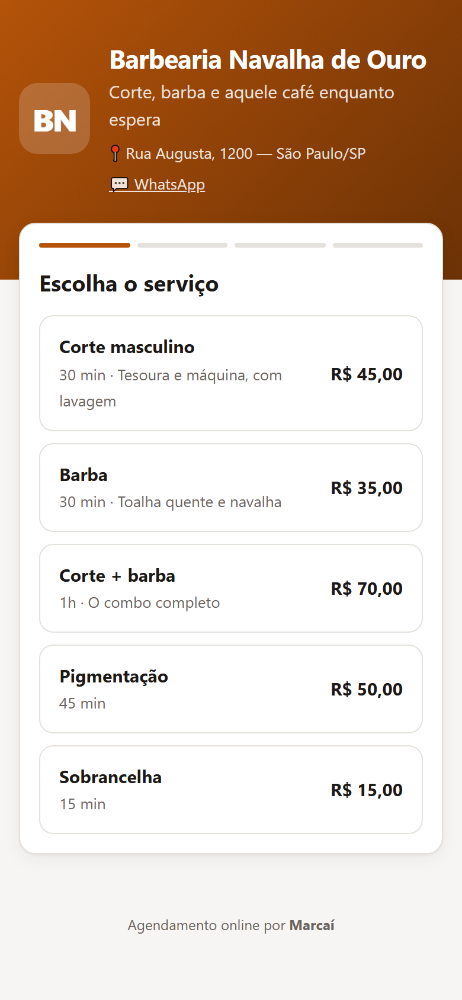
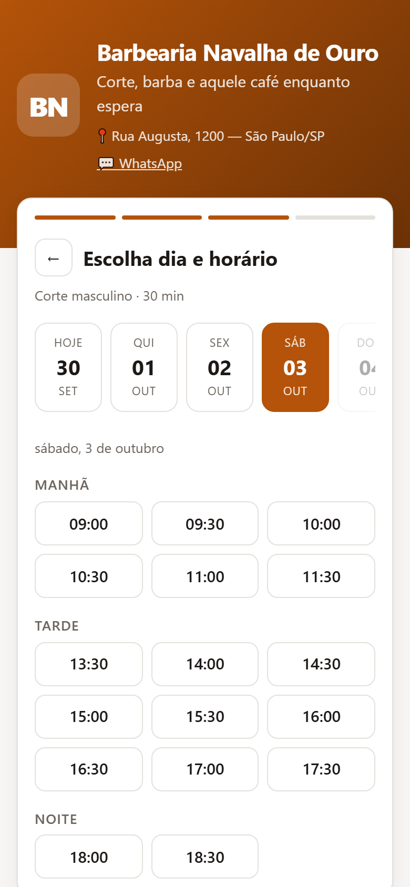
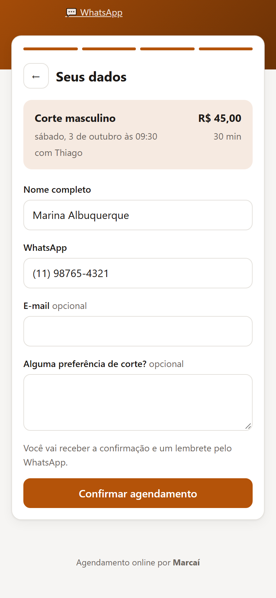
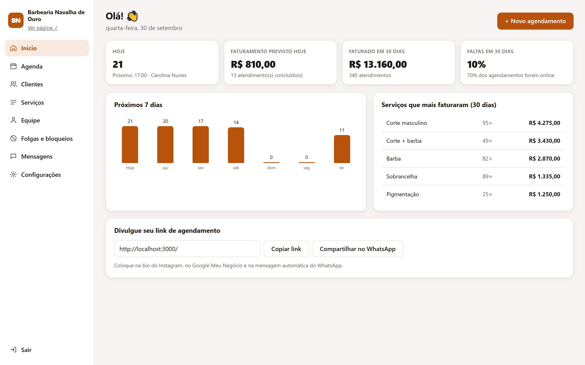
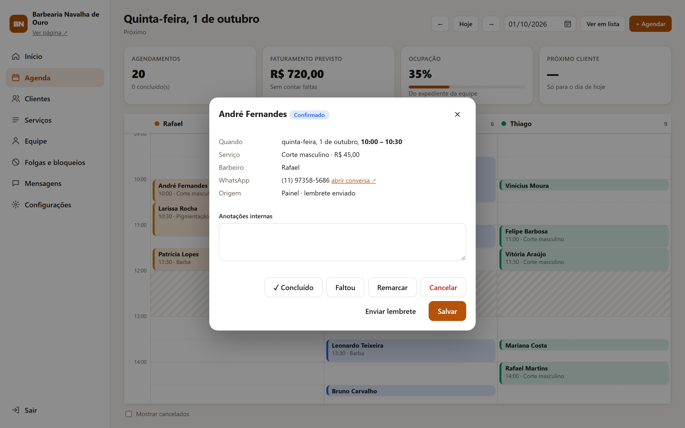
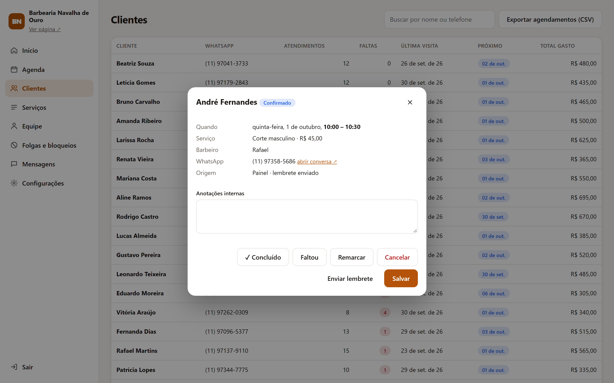

# Marcaí — agendamento online para pequenos negócios

Sistema de agendamento completo para **salão, barbearia, clínica ou oficina**: o cliente marca pelo celular, o dono acompanha tudo num painel e o sistema manda confirmação e lembrete automático pelo WhatsApp.

- **Zero dependências**: só Node.js 22.13+ (usa o SQLite embutido do Node). Sem `npm install`, sem build.
- **Um banco em arquivo** (`data/marcai.db`): backup é copiar um arquivo.
- **Modelos prontos** para 4 segmentos, com dados de demonstração para apresentar a clientes.



## Telas

**O cliente agenda pelo celular**: escolhe o serviço, o dia e o horário livre, e informa nome e WhatsApp.

<table>
  <tr>
    <td></td>
    <td></td>
    <td></td>
  </tr>
</table>

**O dono acompanha tudo no painel**: resumo do negócio, detalhes de cada atendimento e histórico dos clientes.







## Funcionalidades

**Página do cliente** (`/`)
- Escolha de serviço → profissional (ou "sem preferência") → dia → horário → dados
- Só mostra horários realmente livres: respeita expediente, almoço, duração do serviço, folgas e antecedência mínima
- Confirmação com botão para Google Agenda e arquivo `.ics`
- Link pessoal para ver e cancelar o horário (com prazo mínimo configurável)
- Lembra os dados do cliente e os próximos horários no aparelho
- Funciona bem no celular e respeita modo escuro; cor e textos seguem a marca do negócio

**Painel do dono** (`/admin`)
- **Início**: faturamento dos últimos 30 dias, taxa de faltas, ocupação, gráfico dos próximos 7 dias, serviços que mais faturam
- **Agenda**: linha do tempo por profissional (ou lista), clique num espaço vazio para encaixar um cliente, marque como concluído / faltou / cancelado, remarque com sugestões de horários livres
- **Clientes**: histórico, número de faltas, total gasto, atalho para WhatsApp; exportação CSV
- **Serviços**, **Equipe** (serviços que cada um atende e horários com intervalos) e **Folgas e bloqueios** (feriados, férias, um horário específico)
- **Mensagens**: registro de tudo que foi enviado, com reenvio manual
- **Configurações**: dados do negócio, regras da agenda, troca de senha, recriar a partir de um modelo

**Mensagens automáticas**: confirmação, remarcação, cancelamento e lembrete X horas antes (padrão: 24h). O lembrete roda a cada minuto e é enviado uma única vez por agendamento.

## Rodando

```bash
node server.js
```

Abra `http://localhost:3000` (cliente) e `http://localhost:3000/admin` (painel, senha inicial `admin123`).

Na primeira execução o banco é criado com o modelo de barbearia e agendamentos fictícios. Para trocar:

```bash
node src/seed.js clinica --demo
```

Modelos: `barbearia`, `salao`, `clinica`, `oficina`. Sem `--demo`, sobe sem agendamentos (para um cliente real). Também dá para fazer isso pelo painel em Configurações → "Recomeçar com um modelo pronto".

Testes da lógica de agenda:

```bash
npm test
```

## Configuração

Copie `.env.example` para `.env` e ajuste. O mais importante:

| Variável | Para quê |
|---|---|
| `BASE_URL` | Endereço público (vai nos links das mensagens) |
| `ADMIN_PASSWORD` | Senha inicial do painel |
| `SEGMENT` / `DEMO_DATA` | Modelo usado quando o banco está vazio |
| `NOTIFY_PROVIDER` | `log` (só registra), `webhook` ou `twilio` |

### Ligando o WhatsApp

- **`webhook`** (recomendado): o sistema faz `POST` com `{ to, email, message, kind, appointment }` na URL configurada. Aponte para um fluxo no **n8n** ou **Make**, ou direto para uma API de WhatsApp como **Evolution API** ou **Z-API**. Isso também permite mandar e-mail ou SMS sem mexer no código.
- **`twilio`**: WhatsApp oficial via Twilio. Preencha `TWILIO_ACCOUNT_SID`, `TWILIO_AUTH_TOKEN` e `TWILIO_FROM` (`whatsapp:+14155238886` no sandbox).

`to` vem só com dígitos e DDI (`5511987654321`).

## Publicando

Qualquer lugar que rode Node e tenha disco persistente serve: VPS (Hetzner, Contabo, DigitalOcean), Railway, Render ou Fly.io com volume. Exemplo numa VPS:

```bash
BASE_URL=https://agenda.seunegocio.com.br ADMIN_PASSWORD=... node server.js
```

Coloque atrás de um proxy com HTTPS (Caddy faz isso em 2 linhas) e use `pm2` ou `systemd` para manter rodando. Com `BASE_URL` em `https`, o cookie de sessão passa a ser `Secure`. Para backup, copie `data/marcai.db` todos os dias.

Cada negócio roda numa instância própria (um processo + um arquivo de banco). Para atender vários clientes na mesma VPS, suba cada um numa porta com seu `DB_PATH`.

## Estrutura

```
server.js            HTTP, rotas estáticas, autenticação, erros
src/db.js            Esquema SQLite e configurações
src/booking.js       Regras de disponibilidade e criação/remarcação (o coração do sistema)
src/notify.js        Mensagens, provedores (log/webhook/twilio) e laço de lembretes
src/routes.js        API pública e do painel
src/auth.js          Senha (scrypt), sessão com cookie assinado, limite de tentativas
src/seed.js          Modelos por segmento e dados de demonstração
src/time.js          Datas no fuso do negócio, independente do fuso do servidor
public/              Página do cliente (index.html, app.js) e painel (admin.html, admin.js)
test/                Testes da lógica de agenda (node --test)
scripts/screenshots.js  Gera os prints de docs/ com Chrome/Edge headless (servidor precisa estar rodando)
```

**Decisões que valem a pena explicar numa entrevista**
- Checar disponibilidade e gravar acontecem na mesma transação síncrona: dois clientes não conseguem pegar o mesmo horário.
- O agendamento online só aceita horários que a própria API ofereceu. O painel pode encaixar fora do expediente, mas nunca por cima de outro cliente.
- Horários são guardados como "data + minutos do dia" no fuso do negócio. Assim o servidor pode estar em UTC sem bagunçar a agenda.
- O lembrete é marcado como enviado *antes* do envio. Se o provedor cair, a falha aparece em Mensagens para reenvio manual, e o cliente não recebe a mesma mensagem a cada minuto.
- Trocar a senha invalida todas as sessões, porque o hash da senha faz parte da assinatura do cookie.
- Escritas na API exigem `Content-Type: application/json`, o que bloqueia CSRF por formulário junto com `SameSite=Lax`.

## Próximos passos possíveis

- Pagamento de sinal via Pix (Mercado Pago / Asaas) para reduzir faltas
- Pacotes e planos de assinatura (ex.: "4 cortes por mês")
- Lista de espera: avisar quem quer um horário quando alguém cancela
- Vários negócios numa instância só (multi-tenant) para vender como SaaS
